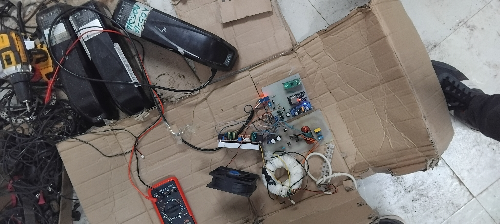
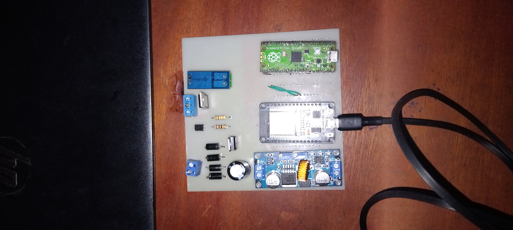

# IoT Enable E-bike Charger Integrating Remote Monitoring and Billing

Electric bikes (e-bikes) are rapidly gaining traction worldwide, including in Kenya.
In Kenya, adoption is rising, particularly among urban and peri-urban commuters who view e-bikes as a cost-effective and sustainable transport option.
A major challenge remains the limited access to affordable and readily available charging infrastructure. Most charging systems are imported, expensive, and not optimized for small-scale operators such as boda boda riders and last-mile delivery services.
There is a need for low-cost, locally adaptable charging solutions with smart monitoring and billing features tailored to the Kenyan e-bike ecosystem.

## 🛠️ Technologies Used
Microcontroller: RaspberryPi Pico / ESP32  
Language: C / C++ / Java / Python  
IDE: Thonny IDE / Arduino IDE / Android Studio  

## ⚙️ Features
1 52V 8A output  
2 Can charge a 13Ah battery within 1.6 hrs  
3 Remote Control of the charger ie User can switch on and off the charger remotely  
4 Remote monitoring of the power output -> the charger has a current sensor that measures the current, the readings are sent to Firebase via wifi  
5 Automatic billing -> the billing is done based on energy consumed in real time and the user can see the amout via our mobile app  
6 User friendly mobile app  

## 📸 Charger Testing

## 📸 Control PCB

